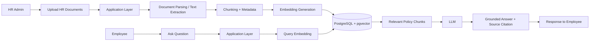

# System Architecture



## Architecture Summary

1. HR admin uploads policy documents.
2. The system extracts text, chunks content, and adds metadata.
3. Each chunk is converted into embeddings and stored in PostgreSQL with pgvector.
4. Employees ask questions in natural language.
5. The question is embedded and matched against the stored chunks.
6. Relevant policy chunks are sent to the LLM.
7. The LLM generates a grounded answer and includes document/source references.

### Key Principles
- Grounded answers from HR policy documents only
- Semantic search using vector similarity
- Scalable storage for growing document volume
- Security and access control planned for future release


## Core flow

```
HR Admin
   │
   │ Upload HR Policy
   ▼
┌─────────────────┐
│ Document        │
│ Processing      │
└────────┬────────┘
         │
         ▼
┌─────────────────┐
│ Chunking        │
│ + Metadata      │
└────────┬────────┘
         │
         ▼
┌─────────────────┐
│ Embeddings      │
└────────┬────────┘
         │
         ▼
┌─────────────────┐
│ PostgreSQL      │
│ + pgvector      │
└─────────────────┘


Employee
   │
   │ "How many paid leaves?"
   ▼
┌─────────────────┐
│ Query Processing│
└────────┬────────┘
         ▼
┌─────────────────┐
│ Vector Search   │
└────────┬────────┘
         ▼
┌─────────────────┐
│ Relevant Policy │
│ Chunks          │
└────────┬────────┘
         ▼
┌─────────────────┐
│ LLM             │
│ Answer          │
└────────┬────────┘
         ▼
┌─────────────────────────┐
│ Answer + Sources        │
└─────────────────────────┘
 ```

 aws architecture DEMO

 ```
                          Internet
                            │
                            ▼
                      API Gateway
                            │
          ┌─────────────────┼─────────────────┐
          │                 │                 │
          ▼                 ▼                 ▼
      /users/*          /products/*       /orders/*
          │                 │                 │
          ▼                 ▼                 ▼
        ALB               ALB               ALB
          │                 │                 │
       ┌──┴──┐           ┌──┴──┐           ┌──┴──┐
       ▼     ▼           ▼     ▼           ▼     ▼
      EC2   EC2         EC2   EC2         EC2   EC2
       │                 │                 │
       ▼                 ▼                 ▼
    User DB          Product DB         Order DB
 ```